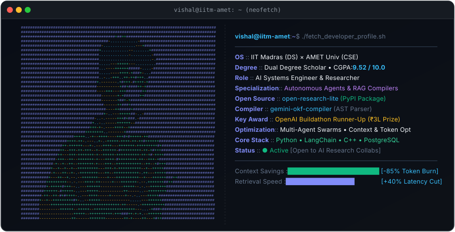

  

  <h1>Vishal Raaj D N D</h1>
  

    <b>AI Systems Engineer &amp; Founder</b> 
    Dual Degree Scholar: <b>IIT Madras</b> (BS in Data Science) &amp; <b>AMET University</b> (B.Tech CSE • 9.52 CGPA)
  

  

    <i>"Observing broken systems, adapting in real time, and engineering deterministic, high-performance software under pressure."</i>
  

  

    
    
    
    
  

   

  <!-- Interactive Terminal Neofetch Component -->
  

 

<!-- ======================================================= -->
<!-- SECTION 1: ABOUT ME (AVATAR ON LEFT)                    -->
<!-- ======================================================= -->

<table border="0" width="100%">
  <tr>
    <td width="26%" align="center" valign="middle">
      
    </td>
    <td width="74%" valign="top">
      <h3>👨‍💻 About Me</h3>
      

        I am an AI Systems Engineer and second-year dual-degree computer science scholar pursuing a <b>BS in Data Science and Applications at IIT Madras</b> alongside a <b>B.Tech in Computer Science and Engineering at AMET University</b> (CGPA: <b>9.52 / 10.0</b>).
      

      

        My core specialization spans <b>Generative AI</b>, <b>Autonomous Agent Architectures</b>, <b>Abstract Syntax Tree (AST) Document Compilers</b>, and <b>Context &amp; Token Optimization</b>. I focus on the hard engineering bottlenecks of modern LLMs — eliminating chunk-boundary context fragmentation in RAG and slashing token consumption in iterative research agent swarms.
      

      <ul>
        <li><b>Research &amp; Engineering Focus:</b> Agentic workflows, AST semantic parsing, production RAG pipelines, and token deduplication.</li>
        <li><b>Current Track:</b> Maintaining open-source packages and scaling enterprise AI infrastructure.</li>
        <li><b>Location:</b> Chennai, India (Available for high-impact AI Engineering &amp; Research collaborations).</li>
      </ul>
    </td>
  </tr>
</table>

 

<!-- ======================================================= -->
<!-- SECTION 2: KEY HONORS & CREDENTIALS MATRIX              -->
<!-- ======================================================= -->

  <h3>🏆 Key Recognitions &amp; Credentials</h3>

<table width="100%">
  <tr>
    <td width="25%" align="center">
       
      <b>National Runner-Up</b> 
      2nd Place • ₹3,00,000 Prize 
      <small>Flagship GenAI Championship</small>
    </td>
    <td width="25%" align="center">
       
      <b>2x Winner</b> 
      Consecutive 1st Place 
      <small>Orbital 3D Simulation Software</small>
    </td>
    <td width="25%" align="center">
       
      <b>9.52 / 10.0 CGPA</b> 
      IIT Madras + AMET/NIAT 
      <small>BS Data Science + B.Tech CSE</small>
    </td>
    <td width="25%" align="center">
       
      <b>7+ National Wins</b> 
      Top Podium Finishes 
      <small>AI / ML &amp; Systems Architecture</small>
    </td>
  </tr>
</table>

 

<!-- ======================================================= -->
<!-- SECTION 3: FEATURED ENGINEERING (AVATAR ON RIGHT)       -->
<!-- ======================================================= -->

<table border="0" width="100%">
  <tr>
    <td width="74%" valign="top">
      <h3>🚀 Featured Engineering &amp; Open Source</h3>
      
      <h4>📦 <a href="https://pypi.org/project/open-research-lite">open-research-lite</a> (Published on PyPI)</h4>
      

        <i>Autonomous Agent Context &amp; Token Optimization Engine • Python, LangChain, AST</i>
      

      

        
        
        
        
      

      <ul>
        <li>Researched, architected, and published an open-source PyPI package that solves exponential token burn and API rate-limiting in iterative autonomous research agents.</li>
        <li>Engineered a <b>semantic concept-diff deduplication algorithm</b> that benchmarks newly gathered research nodes against existing agent memory, pruning redundant tokens before LLM context injection.</li>
        <li>Delivers up to <b>85% context token reduction</b> per research cycle with zero synthesis degradation; provides drop-in modular adapters for LangChain.</li>
      </ul>

      

      <h4>⚡ <a href="https://github.com/vishal-raaj-dnd/gemini-okf-compiler">gemini-okf-compiler</a></h4>
      

        <i>AST-Driven Hierarchical Document Compiler for Advanced RAG • Python, Gemini API, AST, Docker</i>
      

      <ul>
        <li>Engineered an end-to-end compiler converting multi-format unstructured corpora (PDF, DOCX, Markdown) into structured <b>Universal Open Knowledge Format (OKF) AST nodes</b>.</li>
        <li>Eliminated the chunk-boundary semantic fragmentation and lost cross-references caused by naive character chunking in conventional RAG pipelines.</li>
        <li>Integrated the Google Gemini API with strict JSON schema enforcement to parse entity relationships into knowledge graphs, cutting retrieval latency by <b>40%</b> while maintaining multi-hop context integrity.</li>
      </ul>
    </td>
    <td width="26%" align="center" valign="middle">
      
    </td>
  </tr>
</table>

 

<!-- ======================================================= -->
<!-- SECTION 4: WORK & FOUNDING (AVATAR ON LEFT)             -->
<!-- ======================================================= -->

<table border="0" width="100%">
  <tr>
    <td width="26%" align="center" valign="middle">
      
    </td>
    <td width="74%" valign="top">
      <h3>💼 Professional &amp; Founding Experience</h3>
      
      <h4>🏢 <b>AXOWEB Technologies</b> — <i>Founder &amp; AI Solutions Lead</i></h4>
      
<b>May 2026 – Present | Chennai, India</b>

      <ul>
        <li>Founded AI and digital transformation solutions firm; architected and shipped production AI automations and custom client platforms.</li>
        <li>Built resilient generative AI pipelines using Google Gemini &amp; OpenAI APIs, LangChain, PostgreSQL, and Pydantic schema validation.</li>
        <li>Engineered backend middleware with real-time token tracking, rate-limiting, and deterministic JSON outputs.</li>
      </ul>

      

      <h4>🤖 <b>Retrod</b> — <i>AI Engineering Intern</i></h4>
      
<b>Jun 2026 – Present | Remote</b>

      <ul>
        <li>Engineered an intelligent WhatsApp conversational assistant deployed for hotel staff SOP guidance and real-time guest service automation.</li>
        <li>Integrated WhatsApp Business API webhooks with LLM backend pipelines, implementing intent classification and context routing to human staff for edge cases.</li>
      </ul>

      

      <h4>🎓 <b>Thinkers Cave</b> — <i>Software Engineering Intern</i></h4>
      
<b>Mar 2026 – May 2026 | Remote</b>

      <ul>
        <li>Integrated GenAI content synthesis and automated assessment generation into a production cloud Learning Management System (LMS).</li>
        <li>Developed responsive UI components connecting client-side applications to backend AI service endpoints, optimizing payload latency.</li>
      </ul>
    </td>
  </tr>
</table>

 

<!-- ======================================================= -->
<!-- SECTION 5: TECHNICAL ARSENAL                            -->
<!-- ======================================================= -->

  <h3>🛠️ Technical Arsenal</h3>

<table width="100%">
  <tr>
    <td width="25%" valign="top">
      <b>AI &amp; Agentic Systems</b>  
      • LLMs &amp; Prompt Engineering 
      • Autonomous Agent Swarms 
      • LangChain 
      • Advanced RAG Pipelines 
      • Vector DBs &amp; Embeddings 
      • AST Document Parsing 
      • Token &amp; Context Optimization 
      • Computer Vision (YOLO) &amp; OCR
    </td>
    <td width="25%" valign="top">
      <b>Languages &amp; Core</b>  
      • Python (Advanced / PyPI Author) 
      • C++ (System Performance) 
      • TypeScript &amp; JavaScript (ES6+) 
      • Node.js &amp; Express.js 
      • RESTful API Architecture 
      • JWT Authentication 
      • HTML5 &amp; CSS3
    </td>
    <td width="25%" valign="top">
      <b>ML &amp; Data Science</b>  
      • Pandas &amp; NumPy 
      • Scikit-Learn 
      • CatBoost &amp; LightGBM 
      • Optuna (Hyperparameter Tuning) 
      • Feature Engineering 
      • NLP &amp; Transformers 
      • Statistical Modeling
    </td>
    <td width="25%" valign="top">
      <b>Databases, Cloud &amp; Tools</b>  
      • PostgreSQL &amp; Supabase 
      • MongoDB &amp; MySQL 
      • SQLite (Room DB) 
      • Docker Containers 
      • Vercel &amp; AWS Deployment 
      • Git &amp; GitHub Actions 
      • Postman &amp; CI/CD Pipelines
    </td>
  </tr>
</table>

 

<!-- ======================================================= -->
<!-- SECTION 6: TELEMETRY & ACTIVITY (AVATAR ON RIGHT)       -->
<!-- ======================================================= -->

<table border="0" width="100%">
  <tr>
    <td width="74%" valign="top">
      <h3>📊 Engineering Telemetry &amp; Activity</h3>
      
      

        
        
      

      

        
      

    </td>
    <td width="26%" align="center" valign="middle">
      
    </td>
  </tr>
</table>

 

<!-- ======================================================= -->
<!-- SECTION 7: CONNECT & COLLABORATE                        -->
<!-- ======================================================= -->

  <h3>📬 Get In Touch</h3>
  
Open to conversations around autonomous agent systems, context optimization, production RAG, and high-impact engineering ventures.

  

    
    &nbsp;
    
    &nbsp;
    
    &nbsp;
    
  

   
  

    © 2026 Vishal Raaj D N D • Built with clean GitHub Markdown
  

