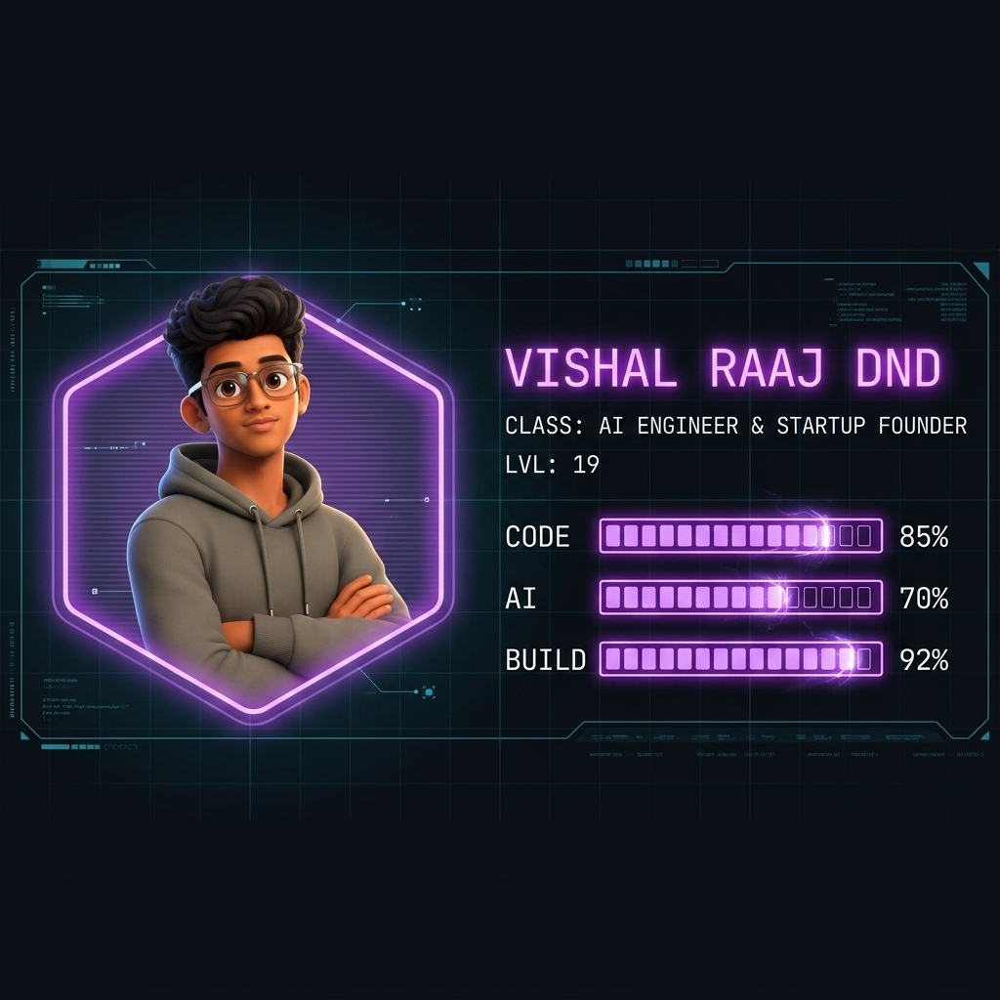

<div align="center">

<!-- GAME HUD HEADER — Upload game_hud_header.png to your repo root -->


</div>

<br/>

<div align="center">

> *"Rigid plans crumble when chaos strikes. I don't follow static blueprints — I observe broken systems, adapt in real-time, and improvise high-performance software under pressure."*

</div>

<br/>

<div align="center">

[](https://github.com/vishal-raaj-dnd)
[](https://www.linkedin.com/in/vishalraajdnd/)
[](mailto:vishalraajdnd@gmail.com)

</div>

---

### 🎮 PLAYER STATS

```text
╔══════════════════════════════════════════════════════════════════════╗
║  PLAYER: Vishal Raaj DND                                             ║
║  CLASS:  AI Engineer & Startup Founder                               ║
║  GUILD:  AXOWEB Technologies (Founder)                               ║
║  REALM:  IIT Madras (BS Data Science) + AMET/NIAT (B.Tech CSE)       ║
║  LEVEL:  19                              GPA: 9.52 / 10              ║
╠══════════════════════════════════════════════════════════════════════╣
║                                                                      ║
║  ⚔️  FULL STACK      ████████████████████░░░░  85%                   ║
║  🧠  AI / ML         ██████████████░░░░░░░░░░  70%                   ║
║  🏗️  SYSTEM DESIGN   ██████████████████░░░░░░  75%                   ║
║  🚀  SHIPPING SPEED  ████████████████████████  92%                   ║
║  🏆  HACKATHON FURY  ██████████████████████░░  88%                   ║
║                                                                      ║
╚══════════════════════════════════════════════════════════════════════╝
```

---


<table width="100%">
  <tr>
    <td width="25%" align="center">
      <br/>
      <b>OpenAI Buildathon</b><br/>
      <code>NATIONAL RUNNER-UP</code><br/>
      <sub>₹3,00,000 • GenAI Championship</sub>
    </td>
    <td width="25%" align="center">
      <br/>
      <b>IITM Space Settlement</b><br/>
      <code>2X WINNER</code><br/>
      <sub>IIT Madras Competition</sub>
    </td>
    <td width="25%" align="center">
      <br/>
      <b>Dual Degree Scholar</b><br/>
      <code>9.52 CGPA</code><br/>
      <sub>IIT Madras + AMET/NIAT</sub>
    </td>
    <td width="25%" align="center">
      <br/>
      <b>Hackathon Berserker</b><br/>
      <code>7+ NATIONAL WINS</code><br/>
      <sub>AI / ML / Full Stack</sub>
    </td>
  </tr>
</table>

---

### ⚔️ EQUIPPED GEAR // TECH LOADOUT

```text
┌─────────────────────────────────────────────────────────────┐
│  ⚔️  WEAPON SLOT:  AI & Agentic Systems                     │
└─────────────────────────────────────────────────────────────┘
```


```text
┌─────────────────────────────────────────────────────────────┐
│  🛡️  ARMOR SLOT:  Full-Stack & Mobile                       │
└─────────────────────────────────────────────────────────────┘
```


```text
┌─────────────────────────────────────────────────────────────┐
│  🎒  INVENTORY:  Databases & Cloud                          │
└─────────────────────────────────────────────────────────────┘
```


---

### 📜 QUEST LOG

```text
╔══════════════════════════════════════════════════════════════════════╗
║  📜 ACTIVE QUESTS                                                    ║
╠══════════════════════════════════════════════════════════════════════╣
║                                                                      ║
║  [★★★] MAIN QUEST: gemini-okf-compiler                              ║
║        ├── AI Compiler & AST Pipeline powered by Google Gemini       ║
║        ├── Converts OKF structure → optimized verified bytecode      ║
║        └── Stack: Python • Gemini API • C++ • Docker                 ║
║                                                                      ║
║  [★★☆] GUILD QUEST: AXOWEB Technologies                             ║
║        ├── Founded AI-powered startup for digital transformation     ║
║        ├── Built enterprise AI chatbots & automation tools           ║
║        └── Stack: React • Node.js • PostgreSQL • LangChain           ║
║                                                                      ║
║  [★★☆] SIDE QUEST: Thinkers Cave (Full Stack Intern)                ║
║        ├── Production web apps, REST APIs, JWT auth systems          ║
║        └── Stack: JavaScript • Node.js • Cloud Deployment            ║
║                                                                      ║
║  [★☆☆] DAILY: Compete in National Hackathons                        ║
║        └── Next target: Another national-level W                     ║
║                                                                      ║
╚══════════════════════════════════════════════════════════════════════╝
```

---

### 📊 BATTLE LOG // LIVE TELEMETRY

<div align="center">


</div>

<br/>

<div align="center">


</div>

<br/>

<div align="center">


</div>

---

### 🔗 JOIN PARTY // CONNECT

<div align="center">

[](https://www.linkedin.com/in/vishalraajdnd/)
[](mailto:vishalraajdnd@gmail.com)
[](https://github.com/vishal-raaj-dnd)

<br/>

```text
[ STATUS: 🟢 ONLINE ]  [ ACCEPTING: Client Quests • Hackathon Raids • AI Co-op Builds ]
```

</div>

